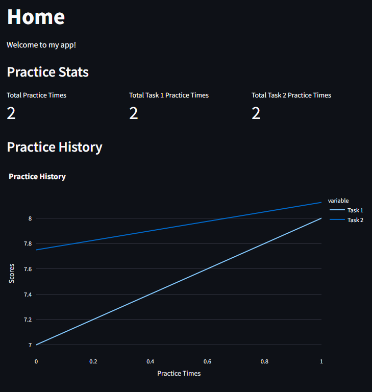
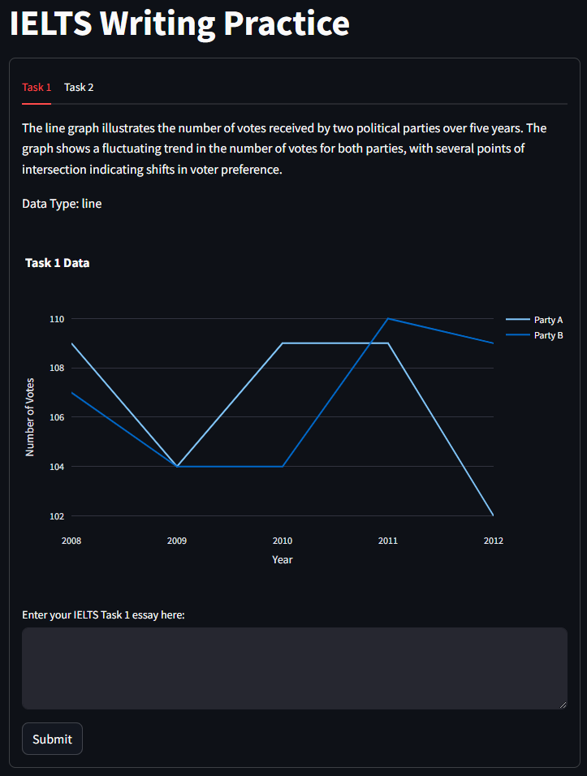
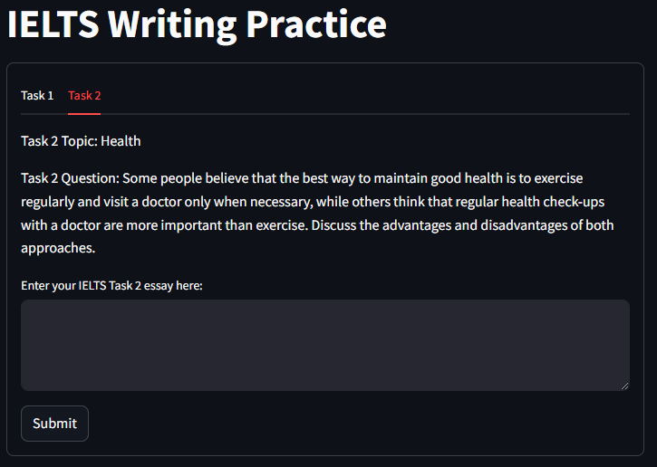
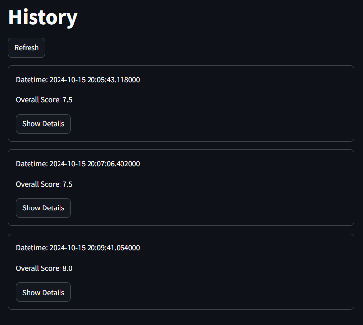

# Writing King

<p align="center">
    <br>
</p>

## Overview

**Writing King** is an easy-to-use IELTS writing practice app designed to help users improve their writing skills by providing personalized essay topics and constructive feedback. The app generates a variety of writing prompts, reducing repetition, and allows users to track their practice progress over time.

## Features

- **Practice History**: Keep track of all your past essays and see how your writing has improved over time.
- **Low-Repetition Topics**: Topics are generated using an advanced large language model (LLM), ensuring a broad variety of prompts with minimal repetition.
- **Completely Free**: The app is 100% free to use with no hidden costs or in-app purchases.
- **Topic Categorization**: Essays are organized into different categories, allowing users to focus on specific writing themes.
- **Feedback and Scoring**: Get detailed feedback and a score for each essay to help identify areas for improvement.

## How It Works

1. **Open the App**: Visit the Writing King website and click on the "Practicing" page to start writing.
2. **Write Your Essay**: Compose your essay directly within the app's editor.
3. **Receive Feedback**: Get immediate feedback on your essay, including a detailed score and suggestions for improvement.
4. **Track Your Progress**: View your practice history to track your writing growth over time.

## Technologies Used

- **MongoDB**: Database used for storing user essays and feedback history.
- **Python**: Core programming language used for backend services and integration with LLMs.
- **Docker**: Ensures a smooth deployment process across different environments.

## Roadmap

- **Enhanced Scoring Accuracy**
  - Improve the feedback and scoring system to align closely with IELTS standards by refining the language model.

- **Multi-Dimensional Analysis**
  - Introduce detailed performance metrics across various aspects like grammar, coherence, and lexical resource to provide deeper insights.

- **Growth Tracking and Progress Visualization**
  - Implement a dashboard that visualizes writing performance trends over time, helping users see their improvements clearly.

- **Expanded Topic Categories**
  - Continuously update and diversify the range of writing prompts to keep the practice engaging and relevant.

- **User-Customized Writing Goals**
  - Enable users to set and track personalized writing goals, focusing on specific skills or target scores.

## Installation

To get started with Writing King locally, follow these steps:

1. Clone the repository:

    ```bash
    git clone https://github.com/hibana2077/writing_king.git
    ```

2. Navigate to the project directory:

    ```bash
    cd writing-king
    ```

3. Set up the API keys for the language model in `docker-compose.yml`:

    ```yaml
    environment:
      - API_KEY=YOUR_GROQ_API_KEY
    ```

If you don't have an API key, you can get one by signing up at [GROQ](https://console.groq.com/keys) It's free!

4. Build and start the app using Docker:

    ```bash
    docker-compose up --build
    ```

5. Access the app at `http://localhost:8080` and start practicing!

## Demo

### Home Page



### Practice Mode (Step 1)



### Practice Mode (Step 2)



### History Page



## Contributing

We welcome contributions to improve Writing King! Please fork the repository, create a new branch, and submit a pull request with your changes.

## License

Writing King is licensed under the MIT License.
